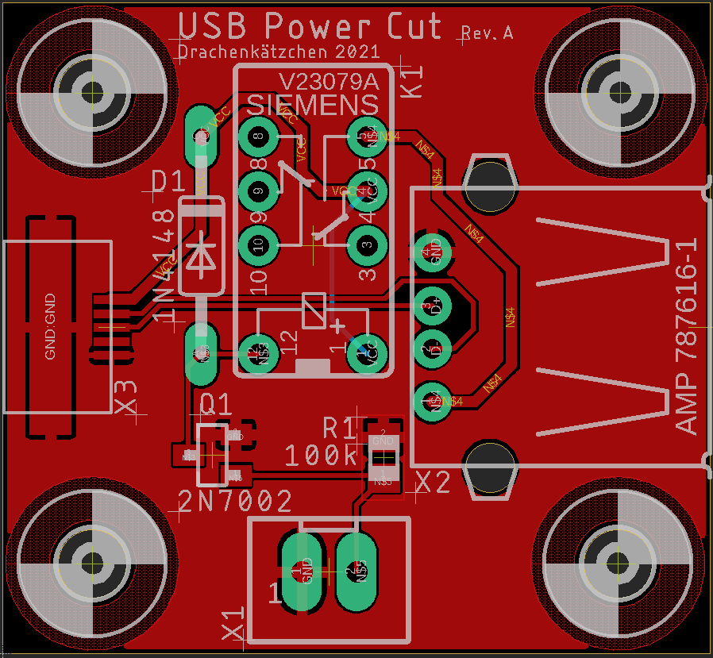

# USB Power Cut

A small PCB to control power to a USB device. I've designed this in order to be able to cut power to a
[HDMI display](https://www.aliexpress.com/item/32889893278.html) when it's not in use, for example, via a Raspberry Pi.

# Specifications

- MicroUSB input
- USB Type A output
- Maximum permissible USB current draw: 1A
- JST XH to control the power. Control voltage 3.3V or 5V.
- Active power consumption 35mA (only when switched on)
- USB data lines are passed through

# Known Issues

- One mounting hole is offset to the right by 0.5mm, the DIN mounting adapter is adjusted for that.

# BOM

| Designator| Part
| ----------|--------------------
| D1 | 1N4148 DO35-10                   
| K1 | V23079-A1011-B301                   
| Q1 | 2N7002 SOT23                     
| R1 | 100k 0805                     
| X1 | JST XH 2 pin
| X2 | AMP 787616-1                       
| X3 | 10104110-0001LF                 

# FAQ

**Why a relay?**

I didn't have any P-channel mosfets in stock, but plenty of those small relays, so that's why I based my design around
them. I rather use components I have in stock than to order new ones.

N-channel mosfets shouldn't be used to control USB power due to possible leakage over the data lines.

**Why not use the RPI4 USB power control functionality?**

On a Raspberry Pi 4, this cuts power to all USB ports. In my case, I only want the display to be turned off. All other
ports should remain on.

